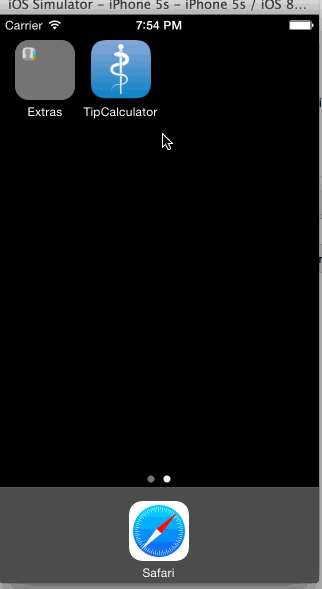

TipCalculatorSwift
==================

   * [x] can Cacluator tip and total fee
   * [x] Can change tip rate, i.e. 10%, 15%, 20%, 25%
   * [x] Can change spilit person number, i.e. 1,2,3,4,5
   * [x] Have a setting page
   * [x] Double numbers show in 2 decimal style

   
 
 Walkthrough 
 --- 

